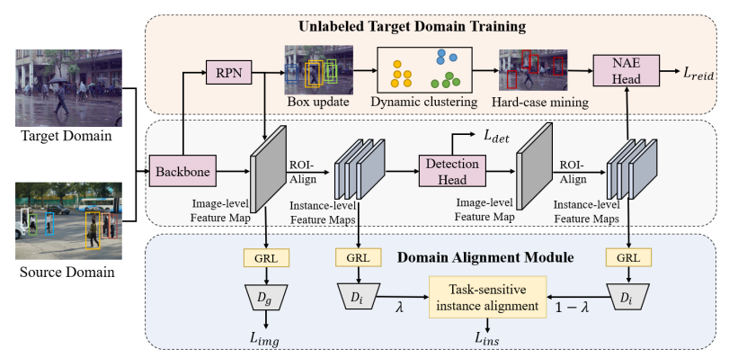

# Domain Adaptive Person Search

## Introduction

This is the official implementation for our paper Domain Adaptive Person Search (DAPS) in ECCV2022. The code is  based on the official code of [SeqNet](https://github.com/serend1p1ty/SeqNet) and [SPCL](https://github.com/yxgeee/SpCL).

Performance :

we tried some hyper-parameters and got better ReID performance reported in our paper.

|  Source   |  Target   | mAP  | Top-1 |                             CKPT                             |                             log                              |
| :-------: | :-------: | :--: | :---: | :----------------------------------------------------------: | :----------------------------------------------------------: |
|    PRW    | CUHK-SYSU | 78.5 | 80.7  | [ckpt](https://drive.google.com/file/d/1VFGiIqGI2SiJ98uIOnGLSqploWLX5AS_/view?usp=sharing) | [train_log](https://drive.google.com/file/d/1f-vGsN_wK08xUZF7R_thEfG18haOj-t6/view?usp=sharing) |
| CUHK-SYSU |    PRW    | 35.3 | 80.2  | [ckpt](https://drive.google.com/file/d/18eSJE3ljFl3SDf2H34PWVhFLmFhij3Rl/view?usp=sharing) | [train_log](https://drive.google.com/file/d/1DMPEqOu5pX2YLFRUFqQKNdAmA1YZDhqv/view?usp=sharing) |



## Installation

run `python setup.py develop` to enable SPCL

Install Nvidia [Apex](https://github.com/NVIDIA/apex)

Run `pip install -r requirements.txt` in the root directory of the project.


## Data Preparation

1. Download [CUHK-SYSU](https://drive.google.com/open?id=1z3LsFrJTUeEX3-XjSEJMOBrslxD2T5af) and [PRW](https://goo.gl/2SNesA) datasets, and unzip them.
2. Modify `configs/prw_da.yaml` and `configs/cuhk_sysu_da.yaml` to change the dataset store place (Line 1,5,6) to your own path.

## Testing

1. Following the link in the above table, download our pretrained model to anywhere you like

2. Evaluate its performance by specifing the paths of checkpoint and corresponding configuration file.

PRW as the target domain:

```
python train_da_dy_cluster.py --cfg configs/cuhk_sysu_da.yaml --eval --ckpt $MODEL_PATH
```

CUHK-SYSU as the target domain:

```
python train_da_dy_cluster.py --cfg configs/prw_da.yaml --eval --ckpt $MODEL_PATH
```

## Training

PRW as the target domain:

```
python train_da_dy_cluster.py --cfg configs/cuhk_sysu_da.yaml
```

CUHK-SYSU as the target domain:

```
python train_da_dy_cluster.py --cfg configs/prw_da.yaml
```

**Note**: At present, our script only supports single GPU training, but distributed training will be also supported in future. By default, the batch size is set to 4, which requires about 27GB of GPU memory. If your GPU cannot provide the required memory, try smaller batch size and learning rate (*performance may degrade*). 
